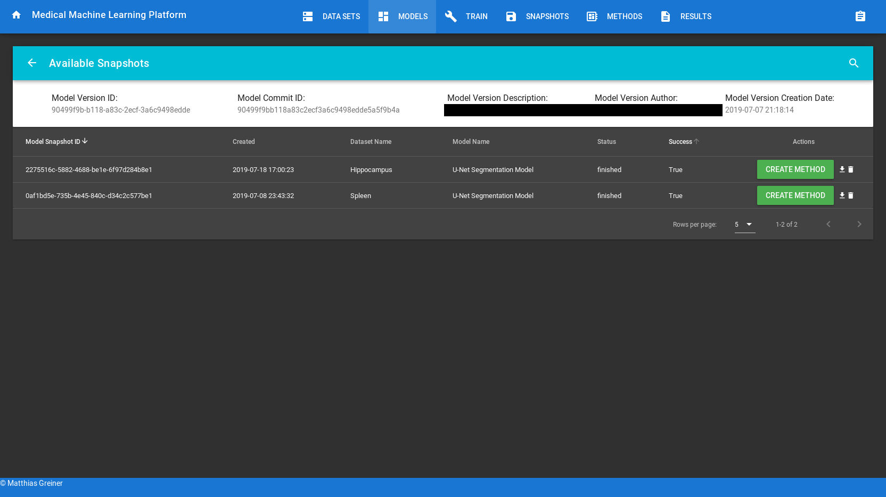
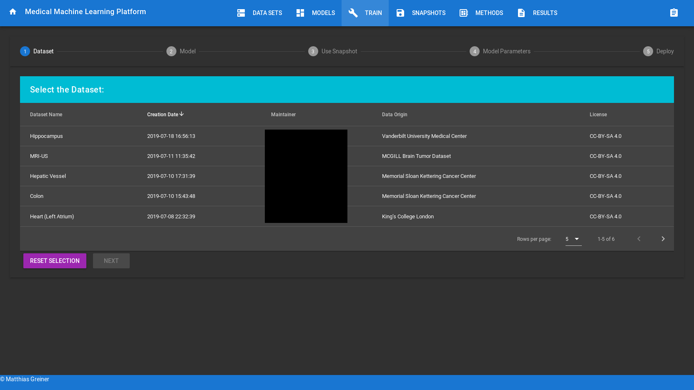
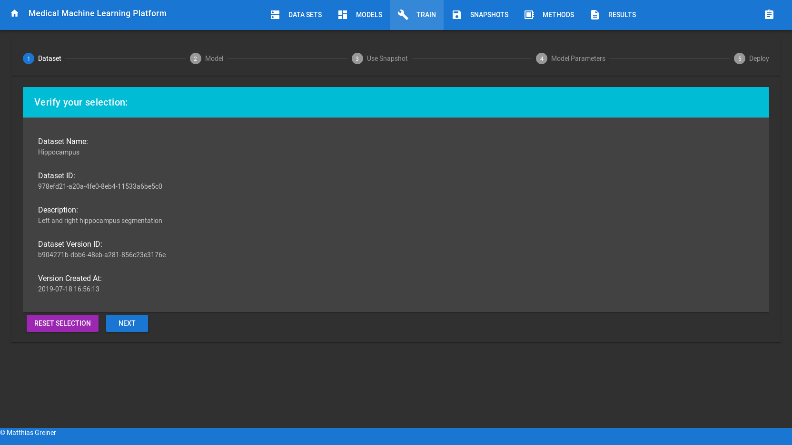
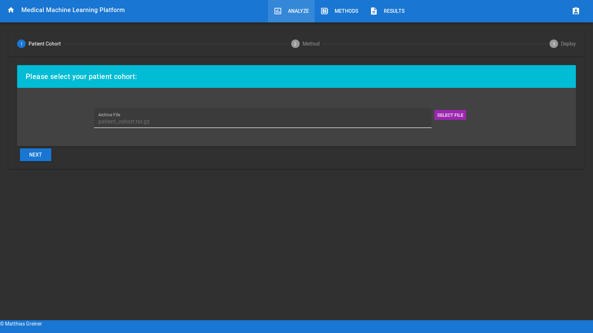

# Medical Machine Learning Platform

## General Information
This repository contains the prototypical implementation of my Masterthesis in 2019 at the *University of Heidelberg* in the medical context of the *German Cancer Research Center (DKFZ)*: 

**Platform to Assist Medical Experts in Training, Application, and Control of Machine Learning Models Using Patient Data from a Clinical Information System** 

The full thesis and further information are published in the Heidelberg Document Repository: [HeiDOKs](http://www.ub.uni-heidelberg.de/archiv/27008).

Further changes and developments after July 2019 were performed independently from the Heidelberg University and the DKFZ.

## Platform Data Storage Structure
All data objects are stored using UUIDs to avoid conflicts with similar objects.

* */data* is per default created and mounted to stores the data of the platform.
* */data/MMLP/models* contains all data related to models, including training snapshots.
* */data/MMLP/datasets* contains all data sets uploaded by the user.
* */data/MMLP/results* if a user uploads data and applies a model, the resulting predictions are stored here.

The configuration is part of the backend, check backend/README and backend/mmlp/config.py

## System Requirements
This prototypical platform implementation does support on-premise, hybrid, and public clouds. 
It is tested on [Amazon Web Services](https://aws.amazon.com/), [Microsoft Azure](https://azure.microsoft.com/), and [Google Cloud](https://cloud.google.com).
In case you need assistance, please contact me.

Before you attempt to deploy the platform, please ensure your system meets the following requirements:

1. [Docker](https://www.docker.com) is installed
2. GPU support is available within docker (if you run machine learning on GPU)
 For Nvidia GPUS: https://github.com/NVIDIA/nvidia-docker
 For AMD GPUs: https://rocm.github.io/
3. If you do not update the default configuration, the following settings are assumed:
 The global folder */data* is used to store all kinds of data related to the platform; it could consume a lot of disk space, depending on your model and data set.
 If you use a distributed computing environment, please ensure this folder is appropriately shared between the computing nodes.
 *Note*: Currently, distribution and scaling are planned but not yet implemented. Please contact me for further information.

## Usage
1. Clone the repository:
```bash
git clone https://github.com/magreiner/MMLP
cd MMLP
```

2. Adjust the configuration
```bash
vi backend/mmlp/Config.py
```

3. Deploy the platform
The platform can be deployed using docker-compose:
```bash
# build the containers (repeat this step every time you changed the code or the configuration)
docker-compose build --parallel

# foreground deployment (useful for development, showing the logs directly):
docker-compose up

# background deployment as service (access logs via docker-compose -f logs)
docker-compose up -d
```

4. Enjoy
 If deployed locally you can access the platform on port 80 with http://localhost
 
 
 *Note:* 
 * https is not activated by default, due to the increased complexity with the certificates. To create certificates [Letsencrypt](https://letsencrypt.org/) is recommended.
 * Sometimes, the browser tries to switch to https automatically and fails. If the platform is not showing as expected, check your browser.


## Screenshots

### Clinical Data Scientist (Developer) View
1. Welcome Page


1. Option to Switch Between Clinical Data Scientist (Developer) View and Medical Expert (User) View


2. Data Set Overview


3. Data Set Version Overview


4. Model Overview


5. Model Version Overview (Commits, ...)


6. Snapshots for a particular Model Version Overview


7. Training Pipeline, please be aware that these pages have dynamic content based on the used model. Therefore this view can vary greatly, depending on the functionality of the used model. Due to copyright, no model is currently included in this prototype.
   1. Select the data set for training
    

   2. Select a version of the data set for training
    

   3. Verify the selection
    

   4. Select the model for training
    
   
   5. Select the version (commit-id) for training
    

   6. Verify the selection 
    

   7. Select a training snapshot for fine-tuning, or create a new training snapshot
    

   8. Verify the selection 
    

   9. Customize the training settings, such as pre-processing and hyper-parameters
    
   
   10. Verify all settings before deployment
    

<!-- 1. Snapshot Overview (independent of the used model)
 -->

8. Method Overview (A method represents a model snapshot, that is exported and made available to a medical expert. It can be used without further configuration)


9.  Result View: An overview of the results of the application of a method by the user. This is intended to allow further debugging by the clinical data scientist.


### Medical Expert (User without machine learning experience) View
1. Welcome Page


2. Method Overview 


3. Analyzing New Data (Use the pretrained model to predict on new data) Guided Pipeline



4. Result View

    
<!-- 
## Backend
Details described in backend directory

## Frontend
Details described in frontend directory 
-->

## Containers
Various containers were helpful during development. Maybe they can be useful for you, too: 

* PACS Container Stack (based on https://www.dcm4che.org)
* Dataset Generators
* Port Redirect
* Postprocessing
* Preprocessing
* Visdom-Docker

# Evaluation of the prototypical platform
The platform (as of July 2019) was evaluated by clinical data scientists and medical experts. For details consult the thesis published here: http://www.ub.uni-heidelberg.de/archiv/27008
